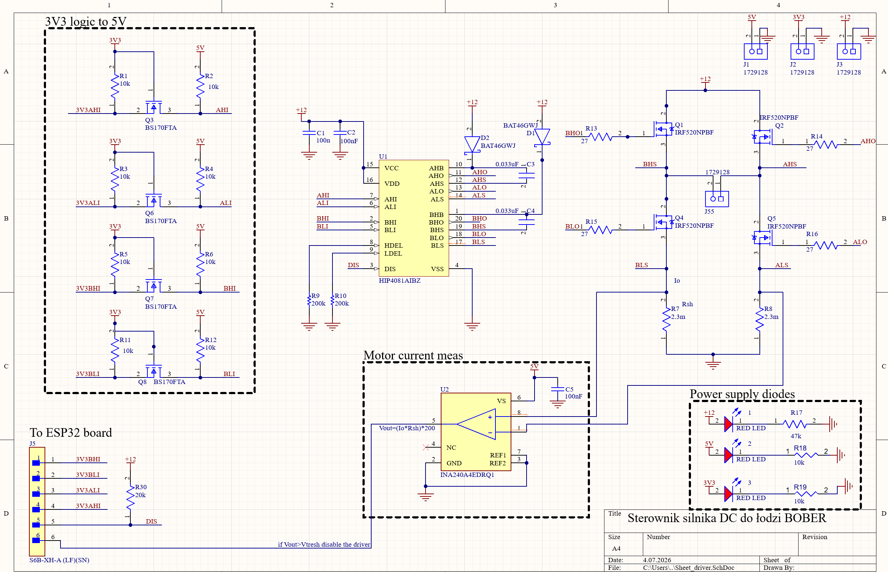
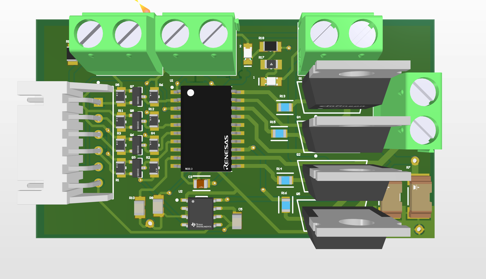

# Sterownik silnika DC (H-bridge)

## 📌 Opis projektu
Projekt przedstawia **sterownik silnika prądu stałego (mostek H)** umożliwiający sterowanie kierunkiem oraz prędkością obrotową silnika.

Układ pozwala na sterowanie sygnałami z mikrokontrolera ESP32.

---

## ⚙️ Funkcje
- Sterowanie kierunkiem obrotów (przód / tył)
- Regulacja prędkości PWM
= Monitorowanie prądu silnika, możliwośc automaycznego odłączenia mosfetów poprzez DISABLE i pomiar diff op ampem.

---

## 🔧 Schemat układu

  

---

## 🧩 PCB (Altium Designer)

  

